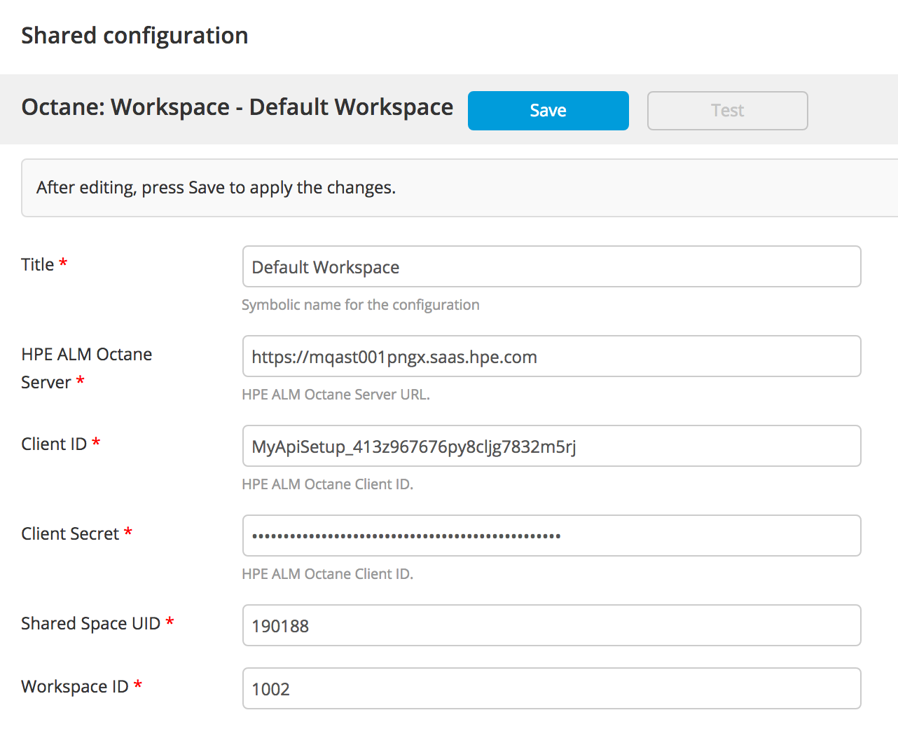
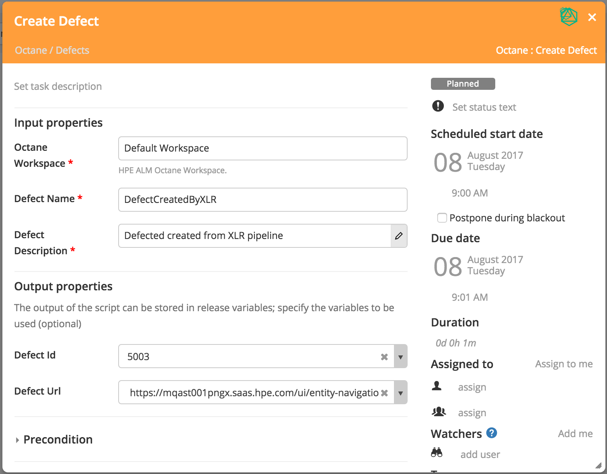
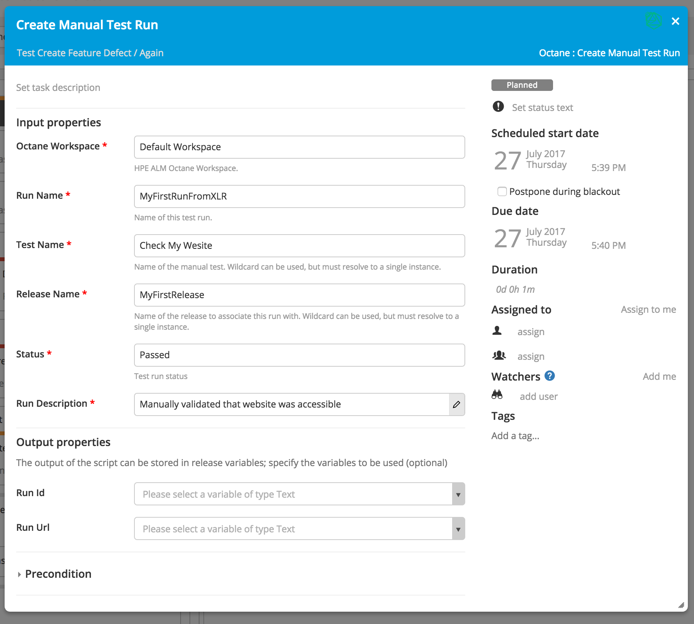

# xlr-hpe-alm-octane-plugin

[![License: MIT][xlr-bitbucket-plugin-license-image] ][xlr-bitbucket-plugin-license-url]
[![Github All Releases][xlr-bitbucket-plugin-downloads-image]]()

[xlr-bitbucket-plugin-license-image]: https://img.shields.io/badge/License-MIT-yellow.svg
[xlr-bitbucket-plugin-license-url]: https://opensource.org/licenses/MIT
[xlr-bitbucket-plugin-downloads-image]: https://img.shields.io/github/downloads/xebialabs-community/xlr-hpe-alm-octane-plugin/total.svg

## Preface
This document describes the functionality provided by the `xlr-hpe-alm-octane-plugin`

## Overview
This module offers a basic interface to HPE ALM Octane functionality.

## Installation
Copy the plugin JAR file into the `SERVER_HOME/plugins` directory of XL Release.

## Octane Workspace
Defines the information about the Octane server you wish to connect to. You must have the Client ID and Client Secret from the server to access the REST API.

## Octane Tasks

### Create Defect
The Create Defect task will create a defect linked to the root backlog.

### Feature Defects Gate
The Feature Defects Gates finds all defects with the specified phase for a feature. The gate will fail when the desired condition is not met.

### Create Manual Test Run
The Create Manual Test Run for a manual test.

---

## References:
